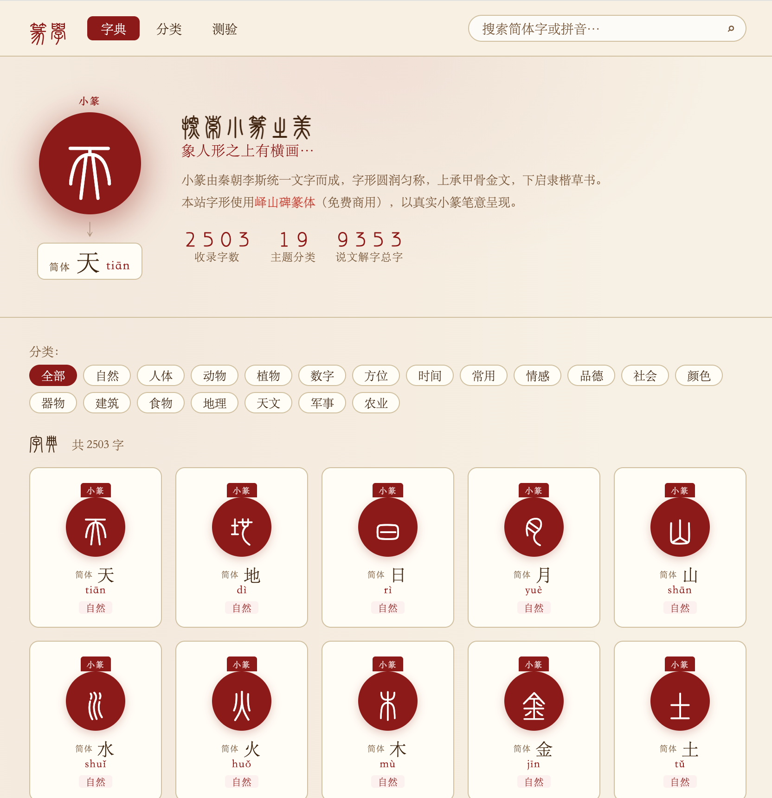
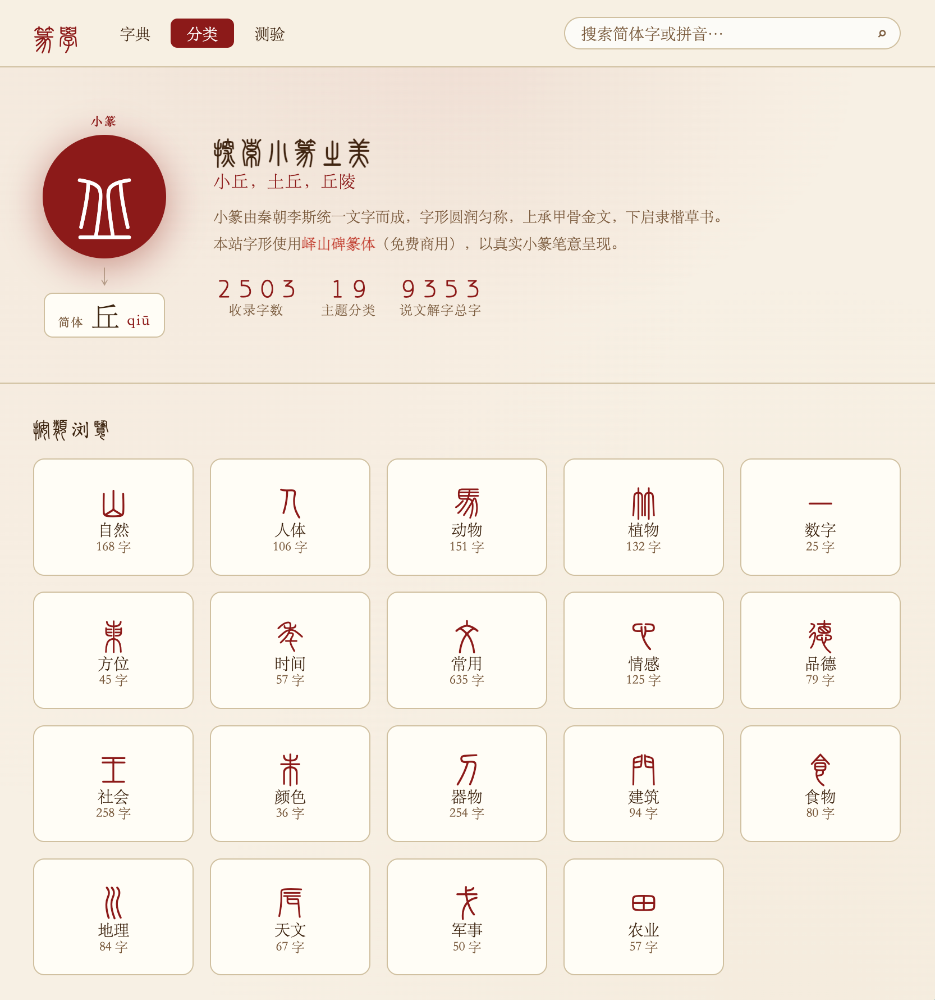

# 四字篆印 · 紧凑印章版

基于 [JackerKun/XiaoZhuan](https://github.com/JackerKun/XiaoZhuan) 修改的本地四字小篆印章工具。保留原项目 MIT 许可与署名，字体授权沿用原项目说明。

## 使用

在项目目录执行 `python -m http.server 8082 --bind 127.0.0.1`，打开 http://127.0.0.1:8082/four.html 。字体已经包含在仓库中，无需构建。

输入四个汉字后自动显示小篆。顺序为左上、左下、右上、右下，例如“天下太平”显示为：

```text
天 太
下 平
```

支持白文/朱文切换、印泥斑驳、字形错落调节和随机章法。根据实际字形边界压缩留白，使四字紧凑地铺满印面。未收录的字会提示缺字。此工具基于字体渲染，不进行古文字字源考证。

`dictionary.html` 保留原字典，`four.html` 为印章入口。核心修改位于 `js/four.js`、`js/stamp.js` 和 `css/compact.css`。

---

# 原项目说明：篆学 · 小篆字典

> 一部收录 2503 字的在线小篆学习工具，字典、分类浏览、趣味测验三合一。

---

## ✨ 特色

- **2503 个常用汉字**，涵盖自然、人体、动物、植物、社会、器物等 19 大主题分类
- **真实小篆字形** — 使用峄山碑篆体（李斯风格，免费商用），原汁原味的秦篆笔意
- **小篆 ↔ 简体** 双向对照，点击任意字卡即可查看详情、说文解字原文、字形演变
- **分类浏览**，按主题快速定位，每类字数一目了然
- **测验模式**，看小篆猜简体字，趣味闯关检验学习成果
- **搜索**，支持简体字或拼音检索
- 响应式布局，桌面 / 手机均可流畅使用

---

## 📸 界面预览

### 字典 — 浏览全部字卡

每张字卡以朱砂红印章圆圈呈现小篆字形，下方显示对应简体字、拼音与所属分类。



---

### 字卡详情 — 深度解读

点击任意字卡，弹出详情层，包含：

- 小篆字形与简体字对照
- 部首 / 笔画 / 分类标签
- 字义说明
- 字形演变描述
- 《说文解字》原文引用
- 常用词例


---

### 分类浏览 — 19 大主题

自然 · 人体 · 动物 · 植物 · 数字 · 方位 · 时间 · 常用 · 情感 · 品德 · 社会 · 颜色 · 器物 · 建筑 · 食物 · 地理 · 天文 · 军事 · 农业

每个分类以对应的小篆字形作为图标，显示该类收录字数，点击即可筛选展开。



---

### 测验 — 看小篆猜简体字

每题展示一个小篆字形（附笔画 / 部首提示），从四个简体字选项中选出正确答案，10 题计分，即时反馈。


---

## 🗂 项目结构

```
XiaoZhuan/
├── index.html          # 页面主结构
├── css/
│   └── style.css       # 全部样式（宣纸风格 · 印章设计）
├── js/
│   ├── data.js         # 字符数据（2503 字）+ 分类配置
│   └── app.js          # 应用逻辑（字典 / 分类 / 测验 / 弹层）
├── fonts/
│   └── ysbzt/          # 峄山碑篆体（本地字体文件）
└── pic/                # 截图
```

---

## 🚀 本地运行

无需构建工具，直接用浏览器打开 `index.html` 即可：

```bash
# 方式一：直接打开
open index.html

# 方式二：使用任意静态服务器（避免字体 CORS 问题）
npx serve .
# 或
python3 -m http.server 8080
```

---

## 🔤 字体说明

小篆字形使用 **峄山碑篆体**（[Chinese Fonts](https://chinese-fonts-cdn.deno.dev/)），该字体忠实还原李斯《峄山碑》笔意，已集成至本地 `fonts/ysbzt/` 目录，无需外部 CDN。

同一 Unicode 汉字在此字体下渲染为对应的小篆字形，因此字典、分类图标、测验题目均为真实篆书，而非图片。

---

## 📊 数据统计

| 项目 | 数量 |
|------|------|
| 收录字数 | 2503 字 |
| 主题分类 | 19 类 |
| 《说文解字》总字参考 | 9353 字 |

---

## 📜 许可

- 代码：MIT License
- 峄山碑篆体：免费商用，详见字体原始授权说明
